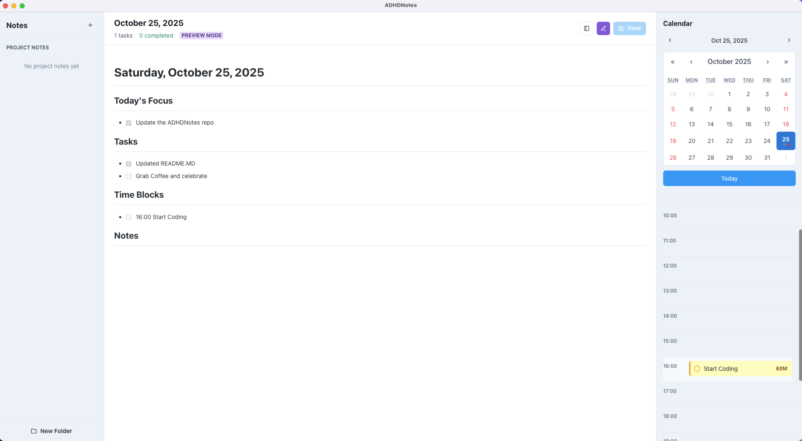
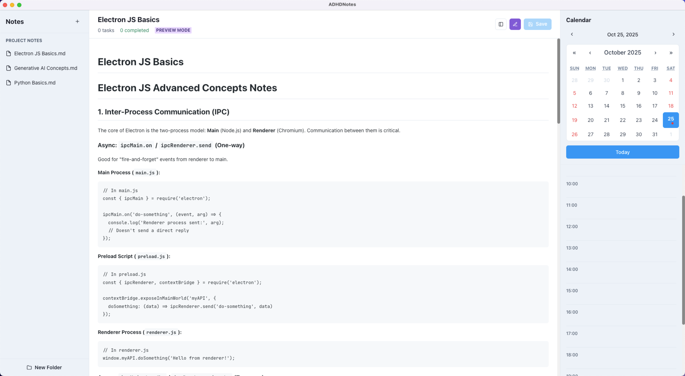
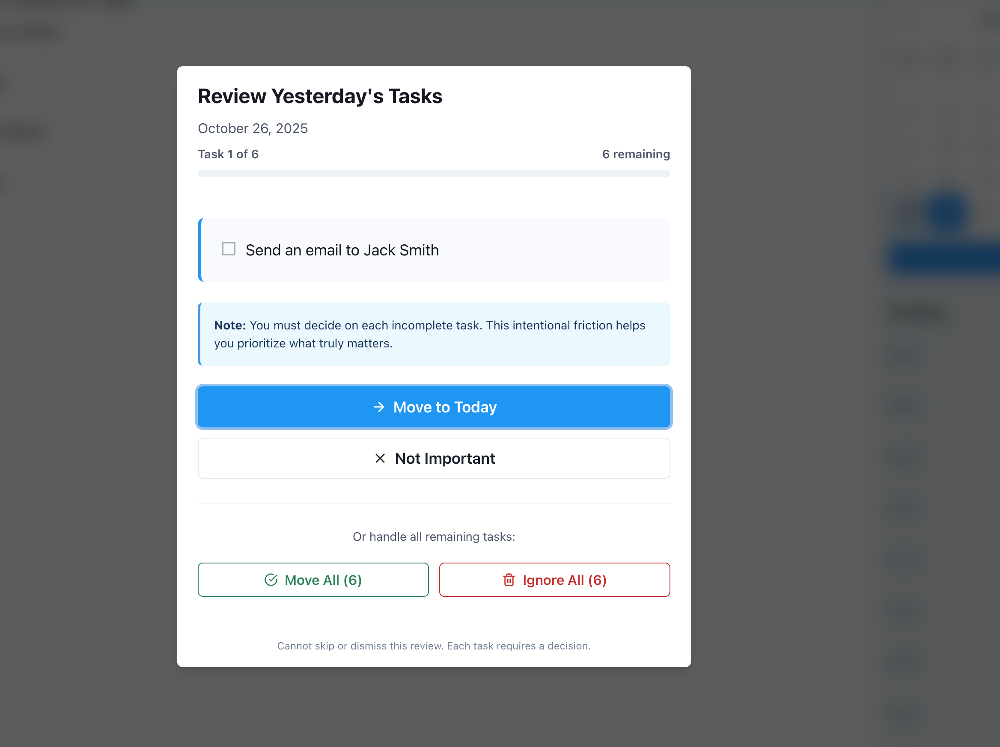

# ADHDNotes

A local-first Electron desktop application for ADHD users that combines **markdown** note-taking with calendar integration and implements forced daily task prioritization through intentional friction.

### **Calendar (Daily) Notes: Task and Time Blocks**

* Notes associated with the calendar 



### **General Notes ** 

* Create non-calendar dependent notes (like any note taking tool)
* All your notes are locally stored 
* Full Markdown support 



### **Daily Task Migration**

Tomorrow when you open the app, if you have incomplete tasks from today, you'll see a modal:

**"Review Yesterday's Tasks"**

You MUST review each task:

- **Move to Today** - Task gets copied to today's note
- **Not Important** - Task is dismissed

This is **intentional**! It forces you to:

- Reflect on what actually matters
- Avoid endless task accumulation
- Make conscious prioritization decisions

You cannot skip this - every task requires a decision.



## Features

- **Local-First Architecture**: All notes stored as plain `.md` files on your filesystem for transparency and data ownership
- **Markdown Editor**: Powered by CodeMirror 6 with custom extensions for task and time block detection
- **Preview Mode**: ⭐ Toggle between markdown editor and beautiful rendered preview with `Cmd+/` (macOS) or `Ctrl+/` (Windows/Linux)
- **Daily Notes**: Automatic daily note creation with date-based organization
- **Project Notes**: Organize notes in folders and sub-folders
- **Task Management**: Inline task checkboxes (`* [ ]` and `* [x]`) with real-time parsing
- **Time Blocks**: Schedule time blocks (`+ [ ]` and `+ [x]`) with duration tracking
- **Calendar Navigation**: Visual calendar for quick date jumping with indicators showing dates that have notes
- **Timeline View**: Hour-based schedule (8 AM - 10 PM) with drag-and-drop task scheduling
- **Forced Daily Migration**: ⭐ Core feature - manually review incomplete tasks from previous days (no automation, intentional friction for reflection)
- **Auto-Save**: Debounced auto-save with 3-second interval
- **File Watcher**: Automatic detection of external file changes
- **Branding**: New app icon and soft pastel UI color palette applied across the app UI to match the ADHDNotes aesthetic (Slate Ink, Calm Teal, Soft Lavender, Pastel Peach)

## Technology Stack

- **Electron**: Cross-platform desktop framework
- **React + TypeScript**: UI framework with type safety
- **Vite**: Build tool and development server
- **CodeMirror 6**: Advanced markdown editor
- **react-markdown**: Beautiful markdown preview rendering
- **Chakra UI**: Component library
- **Zustand**: Lightweight state management
- **date-fns**: Date manipulation
- **@dnd-kit**: Drag-and-drop functionality
- **react-calendar**: Calendar component with date indicators
- **chokidar**: File system watcher
- **electron-store**: Local settings persistence

## Project Structure

```
app/
├── electron/               # Electron main process
│   ├── main.ts            # Main process entry point
│   └── preload.ts         # Security bridge (IPC)
├── src/                   # React application
│   ├── components/        # React components
│   │   ├── layout/       # AppLayout, Sidebar, RightPanel
│   │   ├── editor/       # MarkdownEditor
│   │   ├── calendar/     # CalendarView
│   │   ├── timeline/     # Timeline, TimeSlot
│   │   └── modals/       # MigrationModal
│   ├── stores/           # Zustand state management
│   │   ├── noteStore.ts  # Note loading/saving
│   │   ├── taskStore.ts  # Task operations
│   │   └── appStore.ts   # App settings & migration
│   ├── utils/            # Utility functions
│   │   ├── fileSystem.ts       # File operations
│   │   ├── markdownParser.ts   # Markdown parsing
│   │   ├── dateUtils.ts        # Date utilities
│   │   └── migrationChecker.ts # Migration logic
│   ├── hooks/            # Custom React hooks
│   │   ├── useFileWatcher.ts   # External file changes
│   │   └── useAutoSave.ts      # Auto-save debouncing
│   ├── types/            # TypeScript definitions
│   │   └── index.ts
│   ├── App.tsx           # Main app component
│   └── main.tsx          # React entry point
├── package.json
├── tsconfig.json
├── vite.config.ts
└── README.md
```

## Installation

1. Clone the repository:
```bash
git clone <repository-url>
cd app
```

2. Install dependencies:
```bash
npm install
```

## Development

Run the app in development mode:

```bash
npm run electron:dev
```

This will:
- Start Vite dev server on http://localhost:5173
- Launch Electron with hot reload enabled
- Open DevTools automatically

## Building

Build the application for distribution:

```bash
npm run electron:build
```

This will create distributable packages in the `release/` directory for:
- **macOS**: DMG installer and .app bundle
- **Windows**: NSIS installer and portable .exe
- **Linux**: AppImage, .deb, and .rpm

## Notes Directory Structure

On first launch, the app creates this structure in your Documents folder:

```
~/Documents/ADHDNotes/
├── daily/
│   ├── 2025-10-25.md
│   ├── 2025-10-26.md
│   └── 2025-10-27.md
└── projects/
    ├── Work/
    │   ├── Project Alpha.md
    │   └── Sprint Planning.md
    └── Personal/
        └── Goals 2025.md
```

## Markdown Syntax

### Tasks
```markdown
* [ ] Incomplete task
* [x] Completed task
  * [ ] Subtask (indented with 2 spaces)
```

### Time Blocks
```markdown
+ [ ] Time block without time
+ [ ] 09:00 Team meeting (with scheduled time)
+ [x] 14:00 Code review (completed time block)
```

### Scheduling Tasks
You can drag tasks from the editor to specific time slots in the timeline. The task will be updated with the scheduled time:
```markdown
* [ ] 10:00 Task scheduled for 10 AM
```

### Preview Mode
Toggle between editing and preview mode using the eye icon button or keyboard shortcut `Cmd+/` (macOS) or `Ctrl+/` (Windows/Linux):
- **Edit Mode**: Raw markdown with syntax highlighting
- **Preview Mode**: Beautiful rendered view with styled headings, lists, checkboxes, code blocks, and more

Preview mode shows:
- Formatted headings with borders
- Clickable checkboxes for tasks (read-only in preview)
- Syntax-highlighted code blocks
- Styled blockquotes, tables, and lists
- Links, images, and horizontal rules

### Calendar Date Indicators
The calendar shows blue dots on dates that have notes, making it easy to see which days you've been productive!

## Core Feature: Forced Daily Migration

When you navigate to a new day, if there are incomplete tasks from the previous day, you'll see a modal that blocks the app until you process each task. This is **intentional friction** designed to help ADHD users:

- **No "skip" button** - You must review every task
- **No "move all" button** - Each decision is manual
- **Two choices per task**:
  - **Move to Today** - Copy task to today's note
  - **Not Important** - Dismiss the task

This forces reflection and prioritization, preventing endless task accumulation.

## Settings

Settings are stored in `electron-store` and include:
- Theme (light/dark/system)
- Editor font size
- Timeline start/end hours
- Auto-save interval
- Window dimensions
- Last reviewed date (for migration tracking)

## Development Tips

1. **Hot Reload**: Changes to React code will hot reload. Electron main process changes require app restart.

2. **Debugging**:
   - Renderer process: Use DevTools (opens automatically in dev mode)
   - Main process: Use `console.log()` - output appears in terminal

3. **File System**: All file operations go through IPC for security. See `electron/main.ts` for available IPC handlers.

4. **State Management**: Use Zustand stores instead of prop drilling. Stores are reactive and automatically update components.

## Security

- Context isolation enabled
- No Node.js integration in renderer
- All file operations validated to stay within notes directory
- No network access (except future calendar sync)

## Future Features (Not in MVP)

- Google Calendar integration
- Microsoft Calendar integration
- Dark mode
- Custom themes
- Markdown preview pane
- Search across all notes
- Tags and backlinks
- Export to PDF
- Mobile companion app

## Contributing

This is a personal project built to specification. However, feedback and bug reports are welcome!

## License

MIT

## Credits

Built with love for ADHD users who need structure without judgment.
